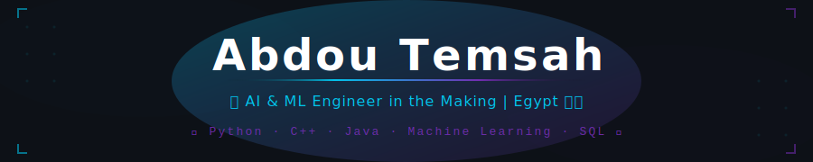

<div align="center">

<!-- ═══ BANNER — upload banner.svg to this same repo ═══ -->


<br/>

<!-- ═══ TYPING ANIMATION ═══ -->
[](https://readme-typing-svg.demolab.com)

</div>

---

## 👋 Hello, World! I'm Abdou


```python
abdou = {
  "name"      : "Abdou Temsah",
  "location"  : "Egypt 🇪🇬",
  "role"      : "CS Student → Future AI/ML Engineer",
  "skills"    : ["C++","Java","Python","SQL","ML"],
  "solving"   : "CF 77+ | LC 33+ Problems 🧠",
  "goal"      : "Build Real-World AI Projects 🚀",
  "mindset"   : "Consistency beats talent 💪",
}
```

- 🎯 **Mission:** Become a **World-Class AI & ML Engineer**
- 🧠 **Problem Solver:** **77+ Codeforces** · **33+ LeetCode** (C++ & Python)
- 📚 **Studied:** Python · ML · SQL & Databases · OOP
- 💻 **Projects:** C++ & Java projects on GitHub
- 🔥 **2025 Goal:** Ship my **first ML project** & hit **200+ problems**

<br clear="right"/>

---

## 🛠️ Tech Stack

<div align="center">

**💪 Using Daily**


**🗄️ Databases**


**🤖 AI / ML (Studied & Learning)**


**🔧 Tools**


</div>

---

## 🧩 Problem Solving

<div align="center">

| Platform | Solved | Language |
|:---:|:---:|:---:|
| [](https://codeforces.com/profile/Abdou_Temsah) | **77+ Problems ✅** | C++ · Python |
| [](https://leetcode.com/u/TemsahCode) | **33+ Problems ✅** | Python · C++ |

> *"Solving problems daily — the grind never stops!"* 🔥

</div>

---

## 📊 GitHub Stats

<div align="center">
  
  
</div>

<div align="center">
  
</div>

---

## 🏅 Quick Stats

<div align="center">


</div>

---

## 🗺️ AI / ML Roadmap

```
✅ Phase 1 — CS Foundations   ████████████░░░░  C++ · Java · OOP · DS & Algorithms
🔄 Phase 2 — Python & Data    ████████░░░░░░░░  Python · SQL · Pandas · NumPy
🎯 Phase 3 — Machine Learning ░░░░░░██████░░░░  Scikit-Learn · ML Models
🔮 Phase 4 — Deep Learning    ░░░░░░░░████░░░░  Neural Networks · TensorFlow
🌟 Phase 5 — Ship AI Products ░░░░░░░░░░░░████  Deploy Real AI to the World
```

---

## 📈 Activity Graph

<div align="center">
  
</div>

---

## 📫 Connect With Me

<div align="center">

[](https://github.com/temsah-dev)
[](https://www.linkedin.com/in/temsaha52022a1)
[](mailto:temsah.dev@gmail.com)
[](https://codeforces.com/profile/Abdou_Temsah)
[](https://leetcode.com/u/TemsahCode)

</div>

---

<div align="center">

> *"An expert is a person who has made all the mistakes that can be made in a very narrow field."* — Niels Bohr


```
╔═══════════════════════════════════════════════════╗
║  Thanks for visiting! Let's build AI together 🚀  ║
╚═══════════════════════════════════════════════════╝
```

</div>
