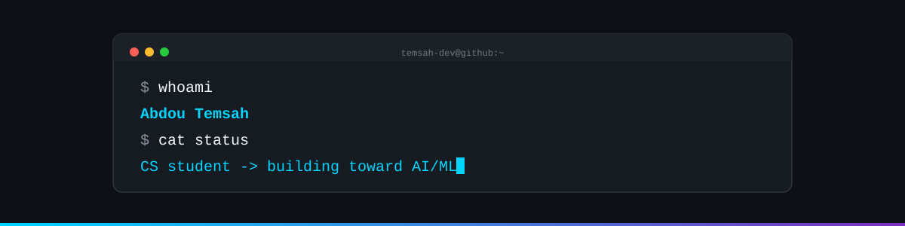

<div align="center">



<br/>

[](https://github.com/temsah-dev)


</div>

---

## About

I'm a CS student in Egypt building toward a career in AI/ML. Right now that means daily reps in C++ and Python, structured problem-solving on Codeforces and LeetCode, and working through the ML fundamentals before shipping something real.

- **Sharpening fundamentals:** 77+ Codeforces problems, 33+ LeetCode problems, mostly in C++ and Python
- **Learning the ML stack:** NumPy, Pandas, scikit-learn, TensorFlow
- **Building:** targeting my first shipped ML project in 2026

Based in Egypt, currently open to internships and entry-level AI/ML roles.

---

## Tech Stack

<div align="center">

**Languages**


**ML & Data**


**Databases & Tools**


</div>

---

## Featured Projects

<div align="center">

[](https://github.com/temsah-dev/REPO_NAME_1)
[](https://github.com/temsah-dev/REPO_NAME_2)

</div>

> 📝 **TODO:** swap `REPO_NAME_1` / `REPO_NAME_2` for two real repos. This card pulls live stars, forks, and language data straight from GitHub, so it stays accurate automatically. It's also the highest-impact change available on this page, ahead of any badge or animation.

---

## Competitive Programming

<div align="center">

| Platform | Solved | Rating | Languages |
|:---:|:---:|:---:|:---:|
| [](https://codeforces.com/profile/Abdou_Temsah) | 77+ | _add rating_ | C++, Python |
| [](https://leetcode.com/u/TemsahCode) | 33+ | — | Python, C++ |

</div>

> 📝 **TODO:** add your Codeforces rank (e.g. Pupil, Specialist) next to the count. To anyone who's done competitive programming, rating says more than raw problems solved.

---

## GitHub Stats

<div align="center">
  
  
</div>

<div align="center">
  
</div>

---

## Roadmap

```
✅ Phase 1 — CS Foundations   ████████████░░░░  C++, Java, OOP, Data Structures & Algorithms
🔄 Phase 2 — Python & Data    ████████░░░░░░░░  Python, SQL, Pandas, NumPy
🎯 Phase 3 — Machine Learning ░░░░░░██████░░░░  scikit-learn, classical ML models
🔮 Phase 4 — Deep Learning    ░░░░░░░░████░░░░  Neural networks, TensorFlow
🌟 Phase 5 — Ship AI Products ░░░░░░░░░░░░████  Deploy real projects
```

---

## Connect

<div align="center">

[](https://github.com/temsah-dev)
[](https://www.linkedin.com/in/temsaha52022a1)
[](mailto:temsah.dev@gmail.com)
[](https://codeforces.com/profile/Abdou_Temsah)
[](https://leetcode.com/u/TemsahCode)

</div>

<div align="center">

Building in public. This page updates as real projects ship.

</div>
